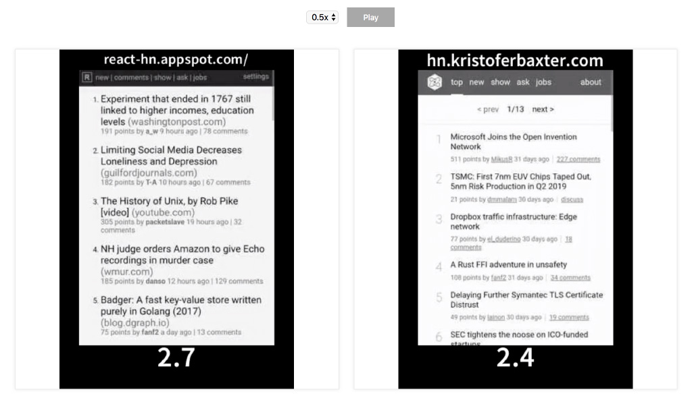

# Video Compare

Side by side playing for [webpagetest](http://webpagetest.org) / [browsertime](https://github.com/sitespeedio/browsertime) videos.

[](https://app.relative-ci.com/projects/b4Aw1c8IcmcsWvkGDpjX)
[](https://greenkeeper.io/)
[](https://circleci.com/gh/relative-ci/video-compare)


[](https://video-compare.relative-ci.com)

## Usage

```
https://video-compare.relative-ci.com/?url=URL1&url=URL2
```

Example: [React HN vs Preact
HN](https://video-compare.relative-ci.com/?url=https://www.webpagetest.org/results/video/18/11/10/JK/58cc2faf46bc8572d87f7b81a0572009.1.0/video.mp4&url=https://www.webpagetest.org/results/video/18/11/10/F4/4b051178d9cf2f1f0b317733ebe05463.1.0/video.mp4)
